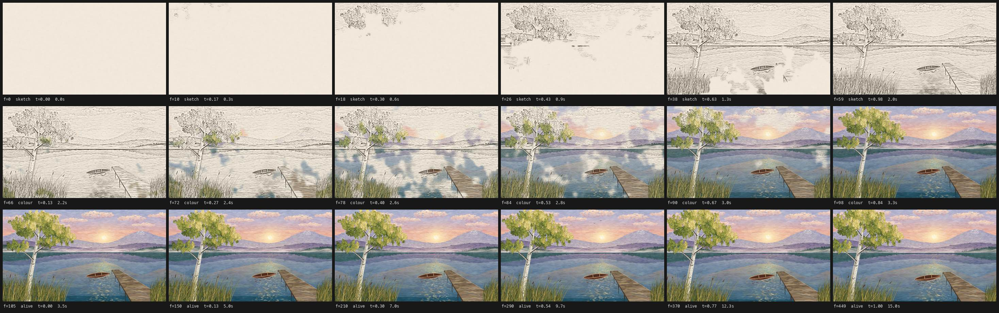
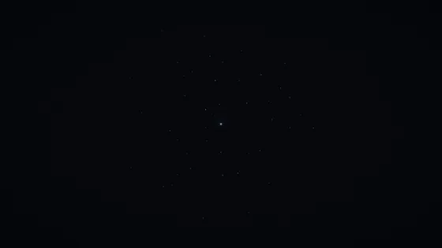
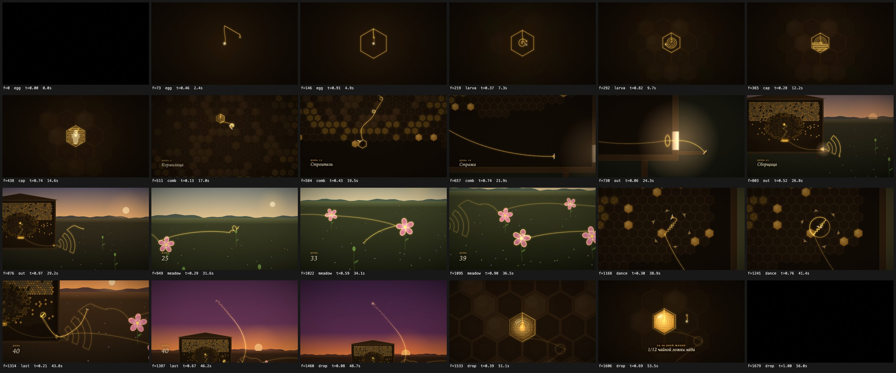

<h1 align="center">framewright</h1>

<p align="center">
  <a href="https://github.com/smwbev/framewright/releases"></a>
  <a href="https://agentskills.io"></a>
  <a href="https://agents.md"></a>
  
  
  <a href="LICENSE"></a>
</p>

<p align="center">
  <sub><a href="README.md">English</a></sub>
</p>

<p align="center">
  <strong>Скилл для агента и шаблон проекта: короткие ролики целиком из кода.</strong><br/>
  Один html-файл. Каждый кадр это чистая функция от <em>(номер кадра, сид, ширина)</em>.<br/>
  Рендер в headless Chrome, сборка ffmpeg, звук синтезируется скриптом. Без футажей, картинок и cdn.
</p>

---

## Рисунок, который становится картиной

<p align="center">
  
</p>

<p align="center"><sub><a href="examples/lake-dawn">«Озеро на рассвете»</a>, 15 секунд, один html на 91 КБ, здесь в двукратном ускорении: проступает карандашный рисунок, сквозь него поднимается масляный цвет, озеро оживает; звук из <code>nature.mjs</code>. Полный mp4 со звуком: <a href="https://github.com/smwbev/framewright/releases/download/v1.4.0/lake-dawn-sample.mp4">lake-dawn-sample.mp4</a> (15 МБ).</sub></p>

<p align="center">
  
</p>

Один вид, написанный один раз и показанный в трёх техниках без склейки. Картина собирается из
закэшированных слоёв мазков. Из неё же вычисляется рисунок сепией: он проступает на бумаге
растущими островками, начиная сверху; масляный цвет поднимается сквозь рисунок снизу мягкими
пятнами, линии растворяются, и картина оживает: вода дрожит, блики плавно загораются и гаснут,
камыш и берёза качаются от одного и того же порыва ветра, камера наезжает. Каждый кадр
по-прежнему зависит только от (кадр, сид, ширина). Звук это ветер, вода, шелест и птицы из
`nature.mjs`, привязанные к репликам фильма и к тому же ветру. Такой проект начинается с
`init.sh --painting`, метод описан в `references/painting.md`, четыре живописных стиля это
номера 13–16 в `references/styles.md`.

## Один мир вместо отдельных сцен

<p align="center">
  
  
</p>

<p align="center"><sub>Слева: <a href="examples/world-demo">демо-мир</a>, который создаёт <code>init.sh --world</code>, 8 секунд. Справа: <a href="examples/honeybee">«Одна линия»</a>, жизнь рабочей пчелы одним кадром, 56 секунд, 1680 кадров, один html на 57 КБ, здесь в пятикратном ускорении. Полный mp4 со звуком: <a href="https://github.com/smwbev/framewright/releases/download/v1.2.0/honeybee-sample.mp4">honeybee-sample.mp4</a> (13 МБ).</sub></p>

<p align="center">
  
</p>

Когда история это одно путешествие без склеек, сцены перестают быть отдельными картинками.
Каждая становится строителем и добавляет свою часть в общий мир: линию, которая помнит, когда
нарисована каждая её точка, ключи камеры с ровными наездами и мягким следованием, свет с
ореолом, титры. Любой кадр рисуется из этого мира и по-прежнему зависит только от (кадр, сид,
ширина). Звук берёт из фильма скорость и положение линии на экране. Такой проект начинается с
`init.sh --world`, метод описан в `references/world.md`.

## Сцены со склейками

Второй режим: отдельные сцены, у каждой своя картинка, склейки попадают в долю. Здесь это
телевизор, которому нечего показать.

<p align="center">
  
</p>

<p align="center">
  
</p>

<p align="center"><sub>Пример RIS TV: 40 секунд, 8 сцен, 1200 кадров, один html на 45 КБ. В публичной версии примера в сцене с портретом стоит синтетическая заглушка. Полный mp4 со звуком: <a href="https://github.com/smwbev/framewright/releases/download/v1.0.0/ris-tv-sample.mp4">ris-tv-sample.mp4</a> (27 МБ).</sub></p>

## Что это делает

Вы описываете ролик. Агент проводит короткий интерактивный бриф, предлагает три концепции
(буквальную, метафору и пародию на жанр), согласует сториборд на музыкальной сетке, потом
строит ролик сцена за сценой и после каждого шага смотрит на отрендеренные кадры. Дальше
рендер кадров, синтез звука под зафиксированные длины сцен, сборка mp4 и проверка файла.
Фотографии превращаются в постеризованные полигоны, а не в пиксели. У каждого шага есть
визуальная контрольная точка и запрет на «и так понятно». Все три вида фильмов выше получаются
одним и тем же процессом: концепцию одним кадром агент строит как единый мир, а вид, который
рисуется, пишется красками и оживает, как живописный фильм.

| Шаг | Что делает агент | Что видите вы |
|---|---|---|
| 0 | проверяет node, ffmpeg, Chrome, python и предлагает доустановить недостающее | короткий отчёт |
| 1 | бриф: сообщение, формат, длина, тон, стиль, материалы, звук, что сдавать | 8–11 вопросов с вариантами по умолчанию |
| 2 | три концепции с палитрой, ключевыми сценами, финалом, звуком и риском | таблица и рекомендация |
| 3 | сториборд в тактах, проект из скелета, первый кадр | одно «поехали» |
| 4 | по одной сцене, три кадра на сцену, контрольный лист каждые 2–3 сцены | контрольные листы |
| 5 | фото трассируется в полигоны, до появления файла стоит заглушка | превью портрета |
| 6 | лист целиком, проверка воспроизводимости, рендер в несколько вкладок, кодирование, проверка по mp4 | превью mp4 |
| 7 | звук по карте реплик, пересборка mp4 | финальный mp4 |
| 8 | варианты по запросу: другой сид, вертикальная версия, gif, кадр-постер | файлы |

Перед полным рендером проверка рисует пробные кадры каждой сцены в семи разных порядках и
требует совпадения пикселей, ищет в коде часы и `Math.random` и падает, если страница грузит
хоть один файл. Mp4 кодируется с матрицей BT.709 и цветовыми тегами, поэтому плееры показывают
те же цвета, что были на проверке.

## Быстрый старт

### Установить скилл (рекомендуется)

```bash
npx skills add smwbev/framewright -g
```

С `-g` скилл ставится для вашего пользователя и виден во всех проектах; без `-g` только в
текущем проекте. Установщик спросит, для каких агентов его поставить (Claude Code, Codex,
Gemini CLI, Cursor, OpenCode и другие); `-a claude-code` выбирает одного без вопросов.

Дальше откройте агента в пустой папке и опишите ролик, например: *«ролик на 20 секунд,
невозмутимый тон, спросить у Ани, когда релиз, в стиле старого телевизора»*. Агент загрузит
скилл, начнёт с брифа и сам соберёт проект.

### Обновить скилл

```bash
npx skills update framewright -g     # если ставили с -g
npx skills update framewright        # если ставили в проект: запускать внутри этого проекта
npx skills list -g                   # что установлено, где лежит и для каких агентов
```

Установщик помнит, откуда взят скилл, и забирает свежую версию с GitHub; что изменилось,
написано на странице [релизов](https://github.com/smwbev/framewright/releases). Уже начатые
ролики хранят свою копию `scripts/`, поэтому обновление их само не меняет. Чтобы дать старому
проекту новые скрипты, скопируйте папку `scripts/` установленного скилла (где она лежит,
покажет `npx skills list -g`) поверх `scripts/` проекта, а его `index.html` не трогайте.

### Или работать внутри клона

```bash
git clone https://github.com/smwbev/framewright my-video
cd my-video
npm install
claude        # или: codex, gemini, cursor, opencode ...
```

Агент подхватит `AGENTS.md` и скилл из клона. Обновление: `git pull`.

### Другие способы

У Gemini CLI свой установщик:
`gemini skills install https://github.com/smwbev/framewright --path .agents/skills/framewright --consent`.
Команды обновления у него нет: выполните `gemini skills uninstall framewright` и установите
заново. Можно и вручную скопировать `.agents/skills/framewright` в проект (Claude Code читает
`.claude/skills/`), а для обновления скопировать ещё раз.

## Поддерживаемые агенты

`npx skills add` кладёт скилл туда, где его ищет каждый агент. Внутри клона этого репозитория
агенты находят его так:

| Агент | Как подхватывает скилл |
|---|---|
| Claude Code | `.claude/skills/framewright` (симлинк на скилл); `CLAUDE.md` импортирует `AGENTS.md`; вызов `/framewright` |
| OpenAI Codex | читает `AGENTS.md` и `.agents/skills/` сам; `$framewright` |
| Gemini CLI | `.gemini/settings.json` указывает на `AGENTS.md`; скиллы из `.agents/skills/` |
| Cursor | `AGENTS.md` и `.agents/skills/` сам |
| GitHub Copilot coding agent | `AGENTS.md` и `.agents/skills/` сам |
| OpenCode, Amp, Zed, Warp, Factory, Cline, Roo, Windsurf | `AGENTS.md`; большинство читают и `.agents/skills/` |
| любой другой | укажите ему на `.agents/skills/framewright/SKILL.md` |

Скилл следует спецификации [Agent Skills](https://agentskills.io): `SKILL.md` с фронтматтером,
`references/` подгружаются по мере надобности, `scripts/` и `assets/`.

## Требования

Node 20+, npm, ffmpeg с libx264, Chrome через Puppeteer (ставится командой `npm install`).
Python 3 с numpy, scipy и Pillow только если будет трассироваться фото. macOS и Linux;
Windows через WSL. Агент сам проверяет всё это перед началом и спрашивает, прежде чем что-то
ставить. В клоне проверку можно запустить руками:

```bash
bash .agents/skills/framewright/scripts/doctor.sh            # отчёт
bash .agents/skills/framewright/scripts/doctor.sh --install  # доустановить недостающее, спрашивает перед каждым шагом
```

## Структура репозитория

```
AGENTS.md                      точка входа для агентов
CLAUDE.md, GEMINI.md           однострочные импорты AGENTS.md
.gemini/settings.json          Gemini CLI читает AGENTS.md
.agents/skills/framewright/
  SKILL.md                     сам рабочий процесс
  references/                  опросник и генератор концепций, стили, движок, фильмы одним миром, живописные фильмы, звук, фото, починки
  scripts/                     doctor, init, look, check, render, build, make, export-curves, trace, inject, portrait
  assets/                      skeleton.html, world.html, painting.html, audio-template.mjs, audio-nature.mjs, nature.mjs, storyboard.md
.claude/skills/framewright     симлинк для Claude Code
examples/ris-tv/               готовый ролик из сцен: index.html, audio.mjs, превью
examples/honeybee/             готовый фильм одним миром без склеек: index.html, audio.mjs, превью
examples/lake-dawn/            готовый живописный фильм: index.html, audio.mjs на nature.mjs, превью
examples/world-demo/           превью демо, которое создаёт init.sh --world
```

## Примеры

`examples/lake-dawn` это «Озеро на рассвете», законченный живописный фильм на 15 секунд: горное
озеро на восходе с берёзой, лодкой и мостками сначала рисуется карандашом, потом пишется маслом и
оживает. В его `index.html` стоит читать живописный набор, painting kit (слои мазков, карандашный
рисунок, вычисленный из самой картины, проявление рисунка и цвета через шумные поля времени,
оживление, наезд камеры), озеро, в котором отражаются небо и горы и которое дрожит полосами, и камыш с кроной
берёзы, качающиеся от одного порыва. `audio.mjs` строит ветер, воду, шелест и птиц на `nature.mjs`
и следует тому же ветру. `npm run example:lake-dawn` запишет его контрольный лист, полный рендер
описан в README примера.

`examples/honeybee` это «Одна линия», законченный фильм на 56 секунд одним кадром: золотая линия
рисует жизнь рабочей пчелы от яйца в ячейке до сот, улья, луга, танца-восьмёрки и последнего
полёта на закате, а её последняя точка падает обратно в соты каплей мёда. Это метод одного мира
в полном масштабе, со звуком, который ведёт сама линия. `npm run example:honeybee` запишет его
контрольный лист, полный рендер описан в README примера.

`examples/world-demo` показывает восьмисекундное демо, которое `init.sh --world` создаёт как
отправную точку для своего фильма.

`examples/ris-tv` это законченный ролик на 40 секунд в стиле старого телевизора, собранный из
сцен со склейками: включение, снег и «НЕТ СИГНАЛА», настроечная таблица со счётчиком дней,
отсчёт, который ломается, две страницы телетекста с вопросом, осциллограф, вычерчивающий
скрепку, портрет, на который захватывается сигнал, и выключение кинескопа. Контрольный лист
примера:

```bash
npm install
npm run example        # запишет shots/example-sheet.png
```

Полный рендер: `HTML=examples/ris-tv/index.html node .agents/skills/framewright/scripts/render.mjs frames 7 1920 5`,
затем `cd examples/ris-tv && node audio.mjs ../../track.wav`, затем `bash .agents/skills/framewright/scripts/build.sh out.mp4`.

## Ролики руками

Скилл заодно и учебник. `references/guide.md` описывает движок, хелперы, музыкальную сетку и
протокол просмотра; `references/styles.md` это каталог шестнадцати визуальных систем с рецептами
пост-обработки; `references/world.md` про фильмы одним непрерывным миром; `references/painting.md`
про живописные фильмы; `references/audio.md` и `references/photo.md` про звук, звуки природы и
портреты. `assets/skeleton.html`, `assets/world.html` и `assets/painting.html` рабочие отправные
точки: откройте любой в браузере для живого предпросмотра, добавьте `?f=30&w=1200` для одного
кадра или `?grid=24` для контрольного листа.

## Лицензия

MIT. Ролики, сделанные с помощью framewright, принадлежат вам.
